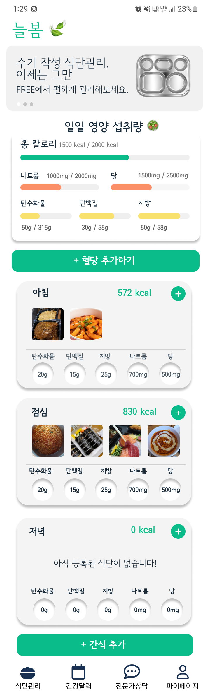
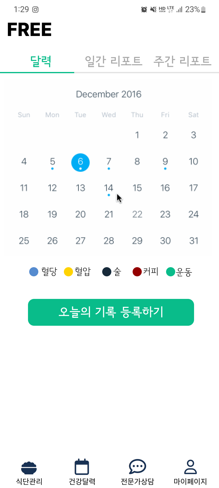
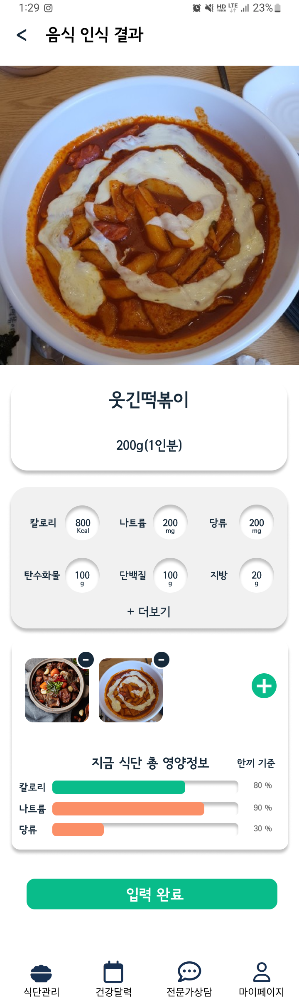
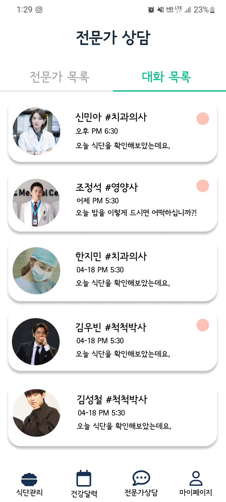
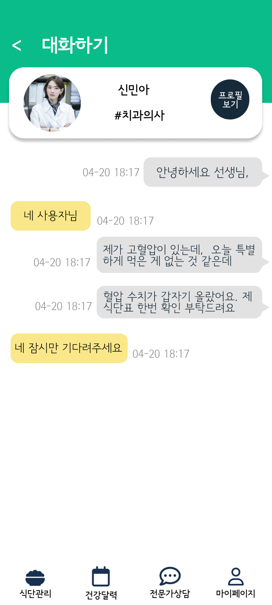

## 와이어프레임

👉 [피그마](https://www.figma.com/file/fprWWOxKks4dGRzZHjsIbB/free-project?node-id=68%3A2) 👈

### 1. 메인 페이지

   

### 2. 건강 달력

   

### 3. 식단 기록

   

### 4. 채팅 목록

   

### 5. 채팅방

   

### 6. 리포트

   
